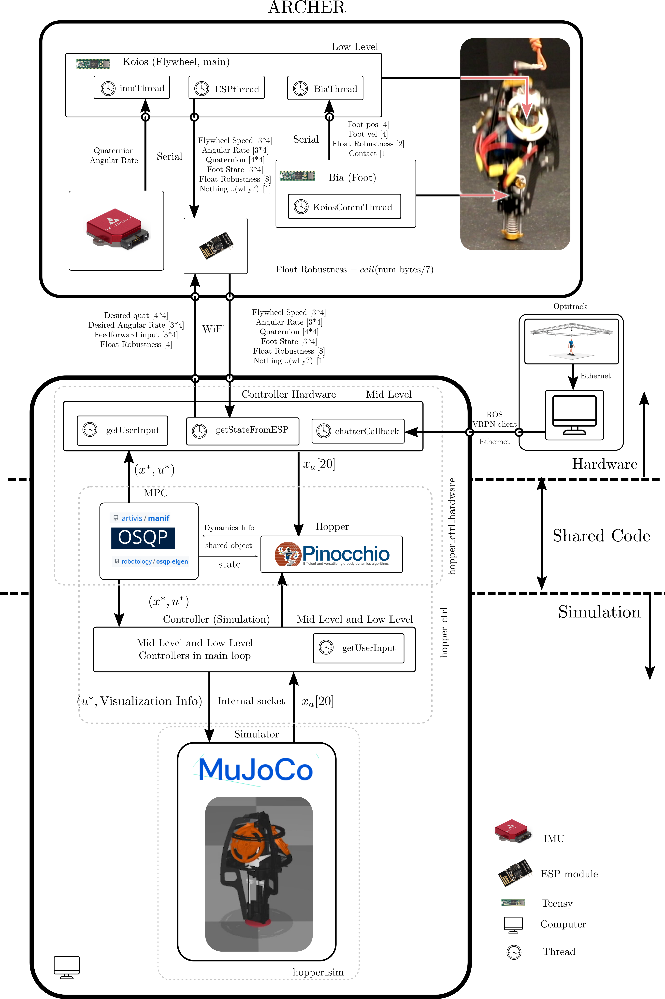

## Hopping Robot Code
This is a (minimally documented) repository for the ICRA 2023 submission: "Nonlinear Model Predictive Control of a 3D Hopping Robot: Leveraging Lie Group Integrators for Dynamically Stable Behaviors". If you have questions or would like more documentation, please feel free to reach out to me!

### Dependencies
* Eigen
* Yaml-cpp (make sure to build with shared libraries on)
* OSQP
* OSQP-Eigen
* glfw3
* Pinocchio (3-preview branch)
* ROS
* Mujoco

### ControlStack
This directory contains all of the code for controlling and simulating the robot. Once built, run ```./hopper_ctrl``` and ```./hopper_sim``` in two separate terminals.

### HardwareStack
This directory contains the code for the hardware platform.

### Connection Diagram

